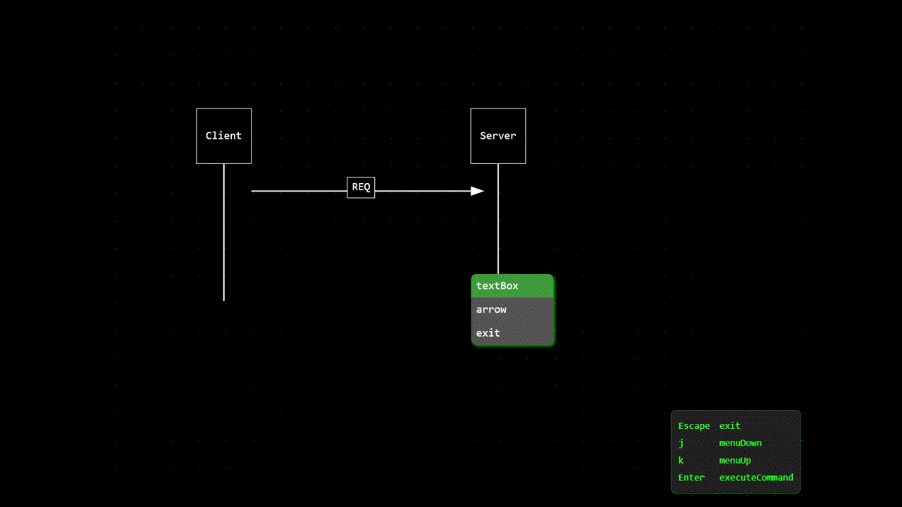

# Vicalc

### Keyboard First Diagram Editor

---

## Features

- Create diagrams only with your keyboard
- Navigate with vim-like keyboard navigation
- Export to .svg

## Download

Current release is v0.2.1. Download an installer for your operating system

| OS      | Link                                                                                                               |
| ------- | ------------------------------------------------------------------------------------------------------------------ |
| Windows | [.msi](../assets/download/vicalc_0.2.1_x64_en-US.msi)                                                              |
| Mac     | [.dmg](../assets/download/vicalc_0.2.1_x64.dmg)                                                                    |
| Linux   | [.AppImage](../assets/download/vicalc_0.2.1_amd64.AppImage) \| [.deb](../assets/download/vicalc_0.2.1_amd64.deb)\* |

_\* .deb cannot be updated automatically._

_\*\* Some browsers give me a warning about the downloaders, just ignore them. I haven't figured this out yet._

## Preview

## Notes

### Notably missing features

- Export to other formats
- Quick save
- Styling
- Sticky connectors
- Fine grained cursor movement
- Undo/redo
- Code signing for various platforms

### FAQ

- Is this free?
  - Yes. The current alpha version is free. I don't know what to do with the final version yet at the moment.
- Is this open-source?
  - No. However, I do have intentions to open source this if I reach a personal financial milestone.
